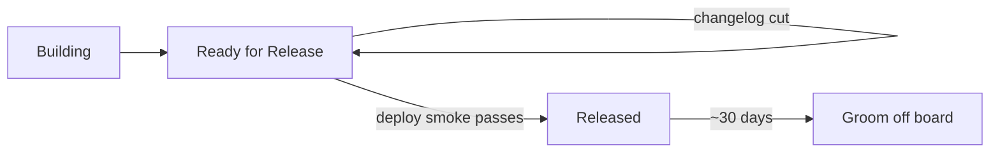

# Release-day roadmap updates

Coordinate with [`bondery-changelog`](../../bondery-changelog/SKILL.md) and [`bondery-release`](../../bondery-release/SKILL.md). This file covers ROADMAP card state only — not deploy mechanics.

## Timeline

## 1. Before changelog cut

For initiatives shipping in this release still in **Building**:

- Move to **Ready for Release**
- Optional comment: `Targeting X.Y.Z` (version from changelog cut — not a Plane date field)

## 2. Changelog cut

Follow [versioning-and-release.md](../../bondery-changelog/references/versioning-and-release.md) — unchanged.

Roadmap cards stay in **Ready for Release** until production deploy is confirmed. Built ≠ live.

## 3. After deploy smoke passes

When [`bondery-release` operator checklist](../../bondery-release/SKILL.md) passes (CI smoke green, manual smoke on product stack):

- Matching **Ready for Release** cards → **Released**
- Add comment with link to release changelog: `https://usebondery.com/docs/changelog` (or anchor to `X.Y.Z` section when available)
- Items that slipped: leave in Ready for Release or revert to Building with an honest comment — do not mark Released

## 4. Monthly groom

- Remove or filter **Released** cards older than ~30 days from the default kanban view
- Changelog remains the durable record

## Release-day checklist

- [ ] In-release cards in Ready for Release before or at changelog cut
- [ ] Changelog dated section cut (`bondery-changelog`)
- [ ] Deploy smoke passed (`bondery-release`)
- [ ] Matching cards moved to Released with changelog link comment
- [ ] Slipped items not falsely marked Released
- [ ] Released cards groomed monthly
