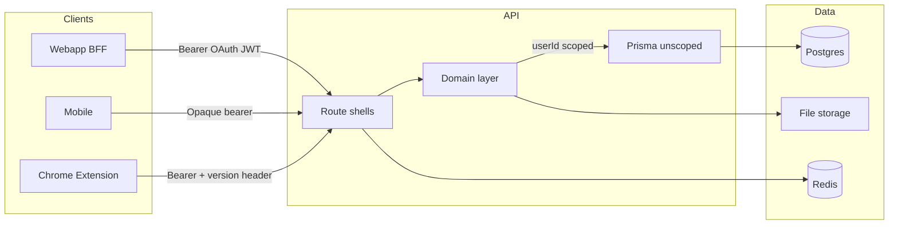

# Security architecture

Trust boundaries and authorization model for the current Bondery stack.

## Trust boundaries



| Boundary | What crosses it | Auth mechanism |
|----------|-----------------|----------------|
| Browser → webapp BFF | REST proxy, sync ticket | Encrypted `bondery_webapp_session` cookie |
| Browser → API (social/OAuth UI) | Better Auth endpoints | Better Auth session cookie on API domain |
| Client → API (data) | REST, sync pull | Session, OAuth JWT, or API key |
| Webhook → API | Polar events | HMAC on raw body |
| Internal → API | Reminder digest, jobs | `BONDERY_PRIVATE_SERVICE_SECRET` bearer |
| Public → API | Avatar/logo files | None (by design) |

## Route shells (canonical)

Auth is wired **only** through shells in `apps/api/src/lib/platform/route-areas.ts`, mounted from `apps/api/src/routes/register-all.ts`.

| Shell | Auth | API keys | `openApiArea` |
|-------|------|----------|---------------|
| `integrationRoutes` | Session or API key + route policy | Allowed | `integration` |
| `sessionRoutes` | Session only | Denied | `session` |
| `adminRoutes` | Session + platform admin role | Denied | `session` |
| `internalRoutes` | Service secret bearer | Denied | `internal` |
| `openApiAreaRoutes` | Custom (webhook HMAC, WS ticket) | N/A | varies |
| `composite` | Per-subtree | Varies | varies |

**Rules:**
- Never add `verifySession` / `verifyAuth` hooks inside individual route modules — CI blocks this (`check-route-security.ts`).
- Every shelled route must have `openApiArea` metadata — `route-security-audit.test.ts` enforces.
- Routes without `openApiArea` deny API keys and log `api_key.missing_open_api_area`.

Docs: `docs/contributing/api-routes.md` (auth table).

## Tenant isolation (critical)

The API uses **application-layer authorization**, not Postgres RLS.

`getAuth(request)` returns the raw, unscoped Prisma client:

```typescript
// apps/api/src/lib/platform/auth/strategies.ts
// IMPORTANT: `client` is the raw, unscoped Prisma client — every query
// built from it must include `where: { userId: user.id }` (or equivalent)
// since there is no RLS to fall back on.
```

**Every domain query** on tenant-owned data must:
1. Get `user` from `getAuth(request)` (inside a protected handler)
2. Scope with `where: { userId: user.id }` or join through an owned parent
3. Return 404 (not 403) when a resource exists but belongs to another user

**Enforcement today:** convention + code review + spot tests (`contacts-groups-tenant-isolation.test.ts`). No Prisma middleware auto-scopes.

**Do not assume RLS protects the API.** Prisma connects as `postgres` superuser in compose.

## Legacy Supabase stack

`apps/supabase-db/supabase/migrations/` contains RLS policies and table grants for the **deprecated Supabase compose path** (`docker-compose.supabase.yml`).

The **current stack** uses:
- `packages/db/prisma/` migrations
- `deploy/bondery/docker-compose.postgres.yml`
- Better Auth + Prisma (no PostgREST, no GoTrue)

RLS migrations are reference material for cloud import or legacy self-hosters — they do **not** protect the active API.

For Postgres query performance on the current stack, see `supabase-postgres-best-practices` (indexes, connection pooling) — not RLS as API security.

## Composite / public routes

`composite` shell has **no automatic auth**. Notable public subtrees:

| Route | Auth | Model |
|-------|------|-------|
| `GET /files/:bucket/*` | None | Public avatars/logos by UUID path |
| Sync WS | WS ticket (60s, single-use) + origin check | Authenticated after ticket exchange |

When adding routes under `composite`, explicitly document the auth model.

## Architecture checklist

- [ ] New route mounted through correct shell in `register-all.ts`
- [ ] No auth hooks added inside route module files
- [ ] `openApiArea` stamped on every shelled route
- [ ] Domain queries scope by authenticated `userId`
- [ ] Cross-tenant access returns 404, not 403
- [ ] Not relying on RLS for API security
