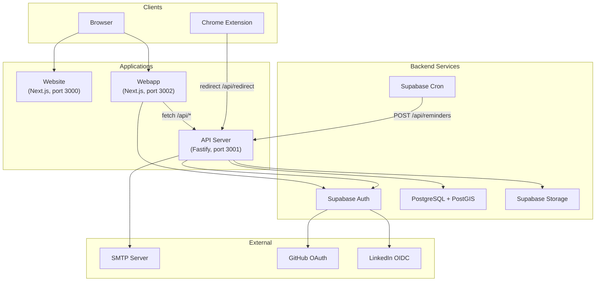

# Architecture Overview

Bondery is a TypeScript monorepo managed by Turborepo. It consists of five deployable applications and six shared packages.

## High-level diagram

## Key principles

- **Monorepo** -- all code in one repository, shared dependencies and types
- **Type safety** -- shared `@bondery/types` package ensures API contracts are consistent across frontend and backend
- **Supabase as backend** -- authentication, database, storage, and cron jobs are all managed by Supabase
- **Server-side rendering** -- both Next.js apps use the App Router with React Server Components
- **Row Level Security** -- all database access is scoped to the authenticated user at the database level

## Application roles

| App | Role | Framework | Port |
|---|---|---|---|
| `apps/website` | Public landing page, SEO, legal pages | Next.js 16 | 3000 |
| `apps/api` | REST API for all data operations | Fastify 5 | 3001 |
| `apps/webapp` | Authenticated application (dashboard, contacts, groups) | Next.js 16 | 3002 |
| `apps/chrome-extension` | Import contacts from social media profiles | React + Parcel | -- |
| `apps/supabase-db` | Database migrations, edge functions, seed data | Supabase CLI | 54321 |

## Shared packages

| Package | Purpose |
|---|---|
| `@bondery/types` | TypeScript types and Supabase database types |
| `@bondery/helpers` | Utility functions and path constants |
| `@bondery/branding` | Brand assets, icons, React icon components |
| `@bondery/mantine-next` | Mantine UI theme and styles for Next.js |
| `@bondery/translations` | i18n messages (Czech, English) |
| `@bondery/emails` | React Email templates (reminders, feedback) |

See [Monorepo Structure](monorepo-structure.md) for the full directory layout and [Tech Stack](tech-stack.md) for technology choices.
