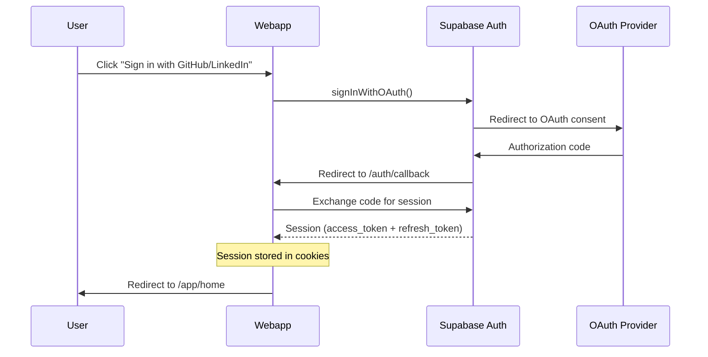
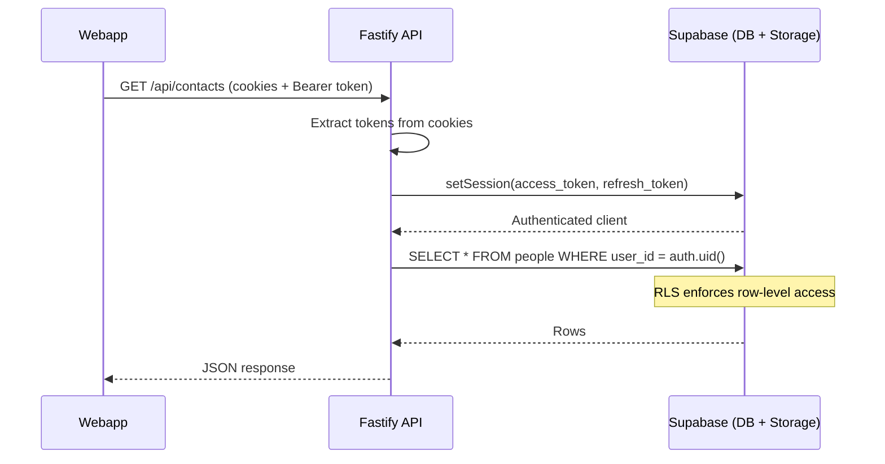
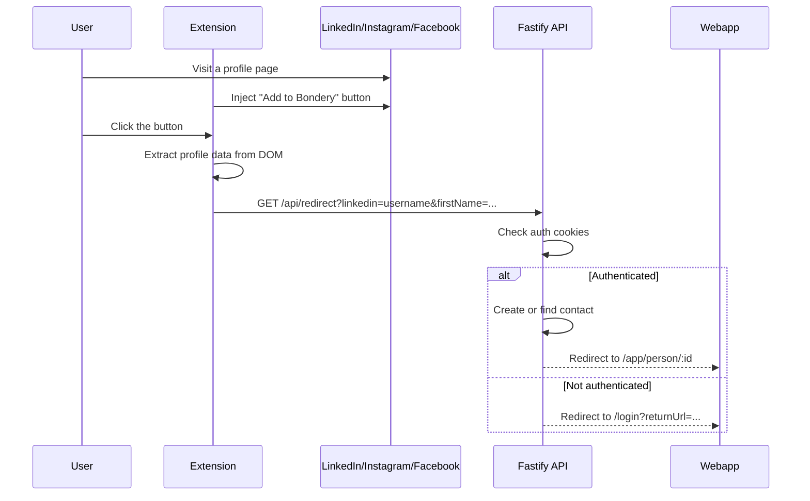
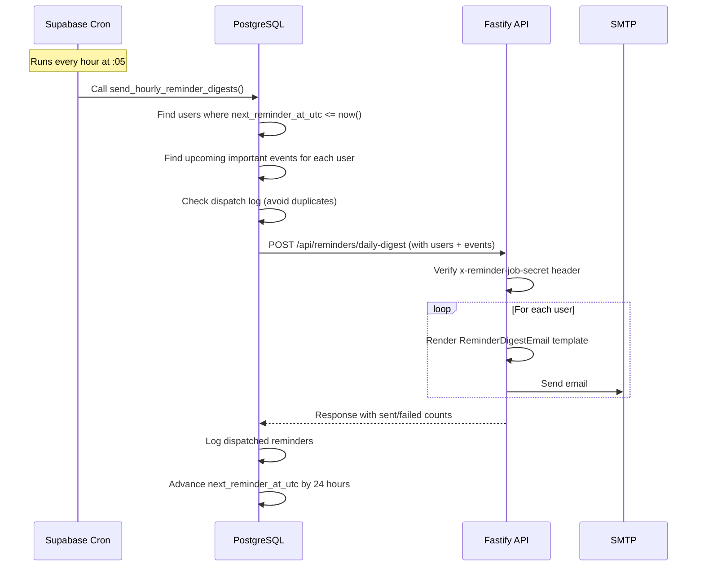
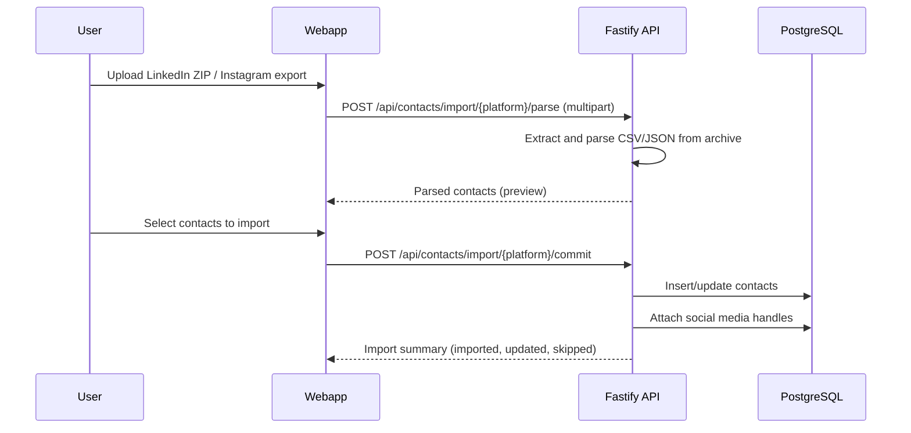

# Data Flow

This document describes how data flows through the Bondery system.

## Authentication flow

On first login, a database trigger (`on_auth_user_created`) automatically creates a `user_settings` row.

## API request flow

All API requests follow this pattern:

1. Webapp makes a server-side fetch to the API, forwarding the user's cookies
2. API extracts Supabase tokens from cookies (supports chunked cookies)
3. API creates an authenticated Supabase client scoped to the user
4. All database queries go through RLS -- the user can only access their own data

## Chrome extension flow

## Reminder dispatch flow

## Data import flow (LinkedIn/Instagram)

