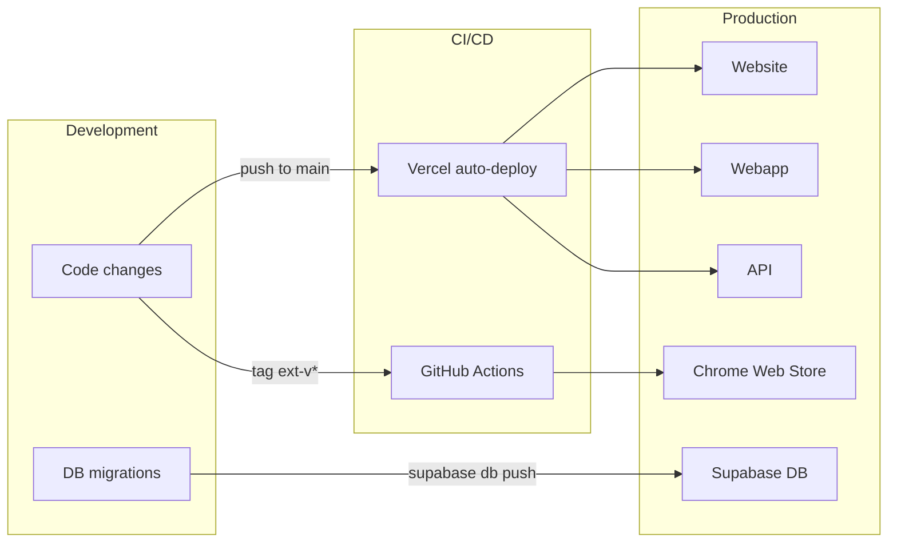

# Deployment Overview

Bondery consists of multiple deployable units, each with its own deployment target:

| App | Hosting | URL |
|---|---|---|
| Website | Vercel | `usebondery.com` |
| API | Vercel (serverless) | `api.usebondery.com` |
| Webapp | Vercel | `app.usebondery.com` |
| Database | Supabase Cloud | Managed PostgreSQL |
| Chrome Extension | Chrome Web Store | Via GitHub Actions |

## Deployment flow

## Key processes

- [Release Process](release-process.md) -- how to release a new version
- [CI/CD](ci-cd.md) -- GitHub Actions workflows
