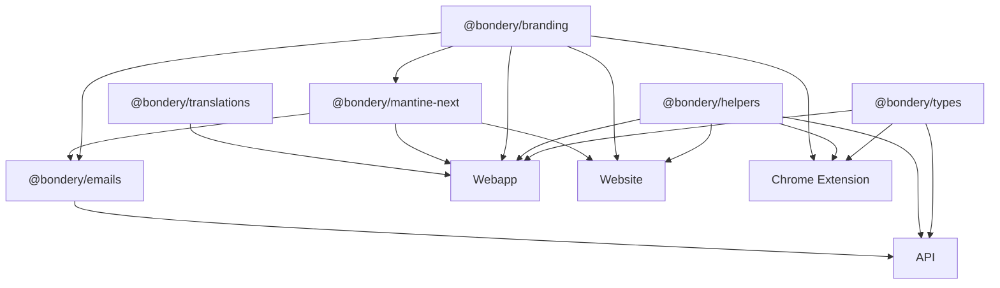

# Packages Overview

Bondery uses shared packages in the `packages/` directory to share code, types, styles, and assets across applications.

## Package summary

| Package | Description | Consumers |
|---|---|---|
| [`@bondery/types`](types.md) | Shared TypeScript types and Supabase database types | API, webapp, chrome extension |
| [`@bondery/helpers`](helpers.md) | Utility functions and path constants | API, webapp, website, chrome extension |
| [`@bondery/branding`](branding.md) | Brand assets, SVG icons, React icon components | All apps and packages |
| [`@bondery/mantine-next`](mantine-next.md) | Mantine theme configuration and CSS | Webapp, website, emails |
| [`@bondery/translations`](translations.md) | i18n messages (Czech, English) | Webapp |
| [`@bondery/emails`](emails.md) | React Email templates | API |

## Dependency graph



## Building packages

Most packages need to be built before they can be consumed:

```bash
# Build all packages
npx turbo build --filter='./packages/*'

# Build specific package
npx turbo build --filter=@bondery/types

# Build the two essential packages (types + branding)
npx turbo build --filter=@bondery/types --filter=@bondery/branding
```

Some packages (`@bondery/mantine-next`, `@bondery/translations`) export TypeScript source directly and don't require a build step.
